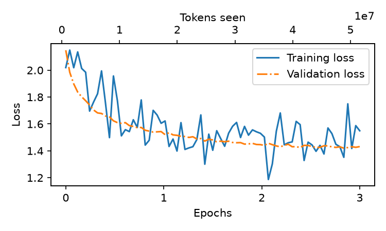

# MLL from Scratch

A small GPT-2-style decoder-only language model implemented with PyTorch. The
project includes tokenization, binary datasets, causal attention, feed-forward
layers, normalization, pretraining, supervised fine-tuning, text generation,
and a small retrieval-augmented generation (RAG) layer.

The pretraining data script streams the `HuggingFaceFW/fineweb-edu`
`sample-10BT` split and writes a small 50,000-token sample by default.

## Training Curve

Example training and validation loss from a completed run on a machine with
4 GB of VRAM and 32 GB of system RAM:



## Project Layout

```text
.
├── pyproject.toml       # Package metadata and editable-install config
├── main.py              # Interactive RAG/text-generation entry point
├── scripts/
│   ├── prepare_data_pretraining.py # Create binary pretraining data
│   ├── prepare_data_finetuning.py  # Create fine-tuning data
│   ├── pretrain.py                 # Run pretraining
│   ├── finetuning.py               # Run supervised fine-tuning
│   ├── evaluate.py                 # Evaluate and generate text
│   └── training.py                 # Shared training utilities
├── configs/model_config.py          # Model and optimizer configuration
├── requirements.txt                 # Python dependencies
├── data/                            # Generated datasets (not committed)
├── checkpoints/                     # Generated model checkpoints
├── plots/                           # Generated loss plots
├── runs/                            # TensorBoard event files
└── src/llm/
    ├── dataset.py       # Memory-mapped token dataset
    ├── model.py         # GPTModel and TransformerBlock
    └── components/      # Attention, feed-forward, GELU, and normalization
```

## Requirements

- Python 3.10 or newer
- PyTorch 2.x
- Internet access is required when downloading datasets or tokenizer files
- CUDA is recommended for training

### Lower-spec hardware

The included training run was completed on 4 GB of VRAM and 32 GB of system
RAM. The project can run on similar hardware, but training may require smaller
batches and shorter sequences. If you run out of GPU memory, start with these
changes:

- Set `batch_size=1` in `scripts/pretrain.py` and `scripts/finetuning.py`.
- Reduce `context_length` from 512 to 256 in `configs/model_config.py`.
- Keep `ACCUMULATE_STEP=2` (or increase it to preserve the effective batch
  size after lowering the per-device batch size).
- Set `num_workers=0` if data-loader worker processes use too much system RAM
  or cause issues on Windows.

Training will be slower on a 4 GB GPU. CPU training is supported through
PyTorch, but pretraining is expected to take considerably longer.

From the repository root, install the project with:

```bash
python -m pip install -r requirements.txt
python -m pip install -e .
```

## Pretraining Data

Run commands from the repository root so the project paths resolve correctly.

```bash
python scripts/prepare_data_pretraining.py
```

This streams `HuggingFaceFW/fineweb-edu` (`sample-10BT`), encodes documents
with the GPT-2 tokenizer, and writes up to 50,000 `uint16` tokens using a
90/10 train/validation split:

```text
data/test_train.bin
data/test_val.bin
```

The pretraining script expects the filenames `writing_train.bin` and
`writing_val.bin`. Copy the generated files before starting training:

```powershell
Copy-Item data/test_train.bin data/writing_train.bin
Copy-Item data/test_val.bin data/writing_val.bin
```

For Bash, use:

```bash
cp data/test_train.bin data/writing_train.bin
cp data/test_val.bin data/writing_val.bin
```

## Training

```bash
python scripts/pretrain.py
```

Pretraining saves `best.pth` under `checkpoints/pretraining/`, the final model
state under `checkpoints/gpt124m_final.pt`, TensorBoard logs under `runs/`, and
loss plots under `plots/`.

View the logs with:

```bash
tensorboard --logdir runs
```

## Evaluation and Generation

After a compatible pretraining checkpoint exists, run:

```bash
python scripts/evaluate.py
```

The script loads both `checkpoints/pretraining/best.pth` and
`checkpoints/finetuning/best.pth`, generates responses for the prompts in
`evaluate_prompt.json`, and prints the generated responses and repetition rate.

## Fine-Tuning

The data-preparation script downloads several instruction datasets and writes:

```text
data/SFT_train.parquet
data/SFT_val.parquet
```

Run:

```bash
python scripts/prepare_data_finetuning.py
python scripts/finetuning.py
```

Fine-tuning loads `checkpoints/pretraining/best.pth` and writes checkpoints to
`checkpoints/finetuning/`. A pretraining checkpoint must exist first.

## Interactive Entry Point

After fine-tuning, run:

```bash
python main.py
```

This loads `checkpoints/finetuning/best.pth` and provides the project’s
interactive generation/RAG workflow. Documents used by the RAG workflow are
stored in `documents/`.

## Model

`GPTModel` uses token and positional embeddings followed by 12 transformer
blocks. Each block applies pre-normalization, causal multi-head self-attention,
a feed-forward network, dropout, and residual connections. The output head
projects hidden states to GPT-2 vocabulary logits.

`GPTDataset` memory-maps the binary token files and returns next-token
prediction pairs. The current pretraining script uses non-overlapping chunks
of 256 tokens.

## Notes

- Training scripts should be run from the repository root.
- Dataset preparation can take time and requires network access.
- The default configuration is intended for experimentation and may require
  adjustment for the available CPU/GPU memory.

## Reference

This project is a learning implementation inspired by:

> Sebastian Raschka, _Build a Large Language Model (From Scratch)_.

